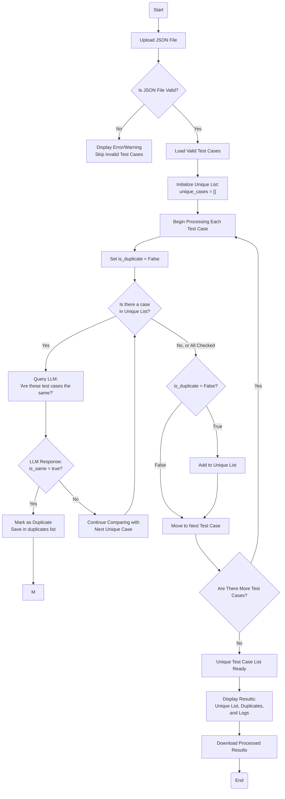

## How It Works?

1. **Initially**, we have a pile of test cases (with information like titles, descriptions, etc.).

2. We create an **empty list called "Unique Test Case List"** (let's name it `unique_cases`).

3. **We iterate through all the test cases**. For each new test case (e.g., `NewCase`):  
   - First, we wonder, "Is there already an identical case?" Since we don't know yet, we set `is_duplicate = False`.  
   - Then, we compare `NewCase` with each **already added unique test case** (`unique_case`). Each time, we ask the LLM:  
     > "Are these two test cases the same or different?"  
   - The LLM responds with `true` (same) or `false` (different).  

4. **If the LLM says "Same!"**:  
   - We conclude, "This new case already exists, so no need to add it."  
   - We skip any further action for this case and move on to the next test case.  

5. **If the LLM always says "Different!"**, meaning the new case does not resemble any previously added case:  
   - We conclude, "This new case is truly unique!" and add it to the `unique_cases` list.  

6. **Once all test cases are processed**, we are left with a list of test cases we consider "unique."  
   - If a case is found to be similar to an already added case (marked as "Same" by the LLM), it is **not added** to the list again.  

7. **As a result**, we have a list of "unique" test cases in one place. The code also keeps a log of which test cases were compared with which, and whether the LLM marked them as "Same/Different." This allows us to look back and answer the question: "Why was this case excluded?"

---

## Process Summary

- We start with an input list (all test cases).  
- For each new case, we compare it with the already added "Unique List" one by one.  
- The comparison is not manual; an AI model (LLM) answers the question, "Are these two cases the same?"  
- If the LLM says "Same," the new case is not added. If the LLM says "Different," the new case is added.  
- In the end, the final list contains only those that were not excluded (i.e., those the LLM found to be "different").



# Installation Guide

This document provides detailed instructions on how to install and set up the necessary dependencies for the Smart Test Case Selector project.

## Step 1: Clone the Repository

First, clone the repository to your local machine:

```bash
git clone <repository_url>
cd <repository_name>
```

## Step 2: Set Up a Virtual Environment (Optional but Recommended)

Create and activate a virtual environment to isolate the dependencies:

For Windows:
```bash
python -m venv venv
venv\Scripts\activate
```

For macOS/Linux:
```bash
python3 -m venv venv
source venv/bin/activate
```

## Step 3: Install Dependencies

Use the following command to install all the necessary Python libraries listed in the `requirements.txt` file:

```bash
pip install -r requirements.txt
```

### Key Libraries Installed

- **Streamlit**: A framework for creating interactive web applications in Python.
- **Pydantic**: A data validation and settings management library using Python type annotations.
- **UUID**: A standard library for generating universally unique identifiers.
- **Ollama**: A library to interact with large language models for intelligent comparisons.
- **Typing Extensions**: Provides advanced type hints for better code compatibility.
- **Datetime**: A standard library for managing timestamps and date-based operations.

## Step 4: Verify Installation

Ensure all dependencies are correctly installed:

```bash
pip list
```

Look for the libraries listed above. If any issues arise, try reinstalling specific libraries using `pip install <library_name>`.

## Step 5: Run the Application

Once everything is set up, you can run the application:

```bash
streamlit run your_script.py
```

This will launch the application in your default web browser.

---

You're now ready to use the Smart Test Case Selector!
